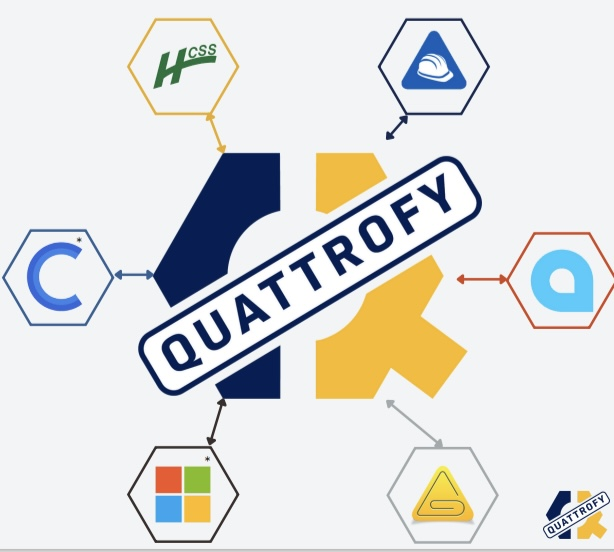
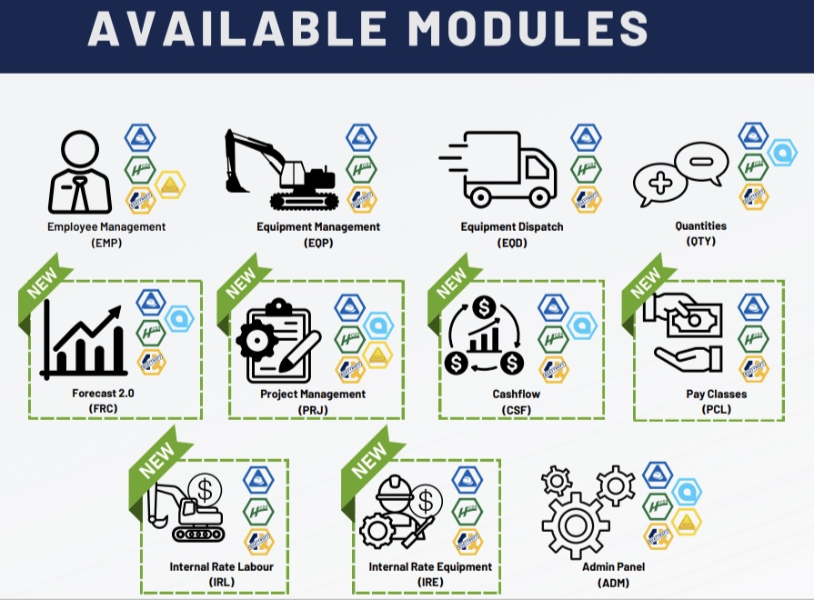
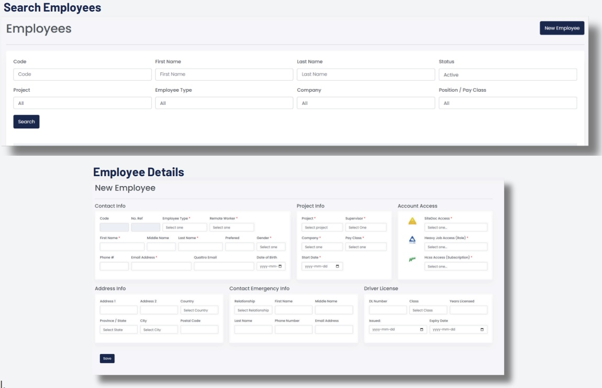
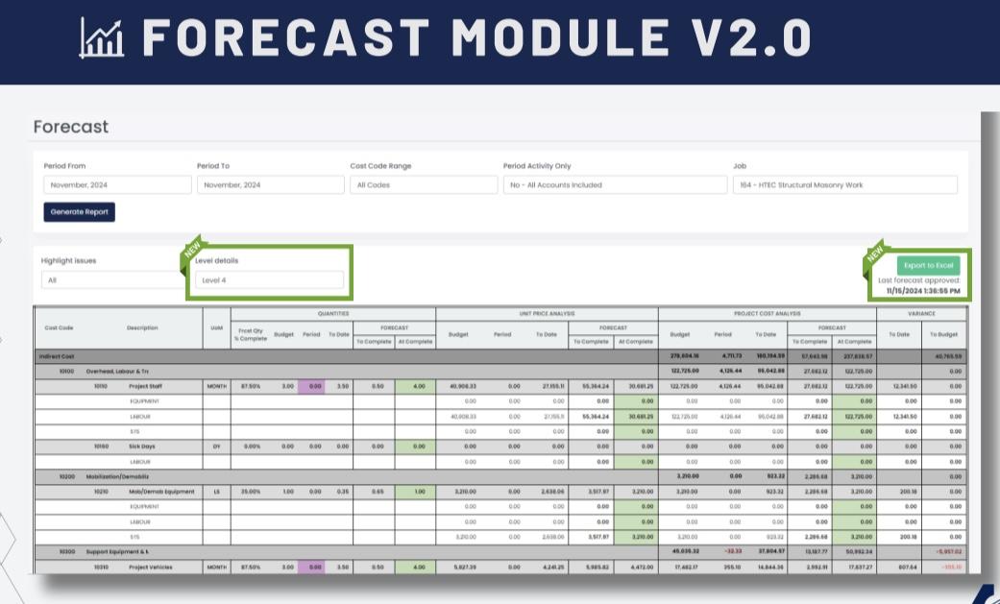
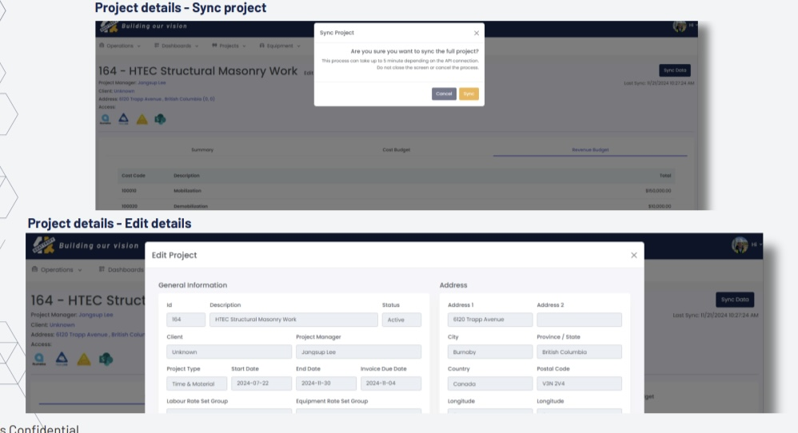
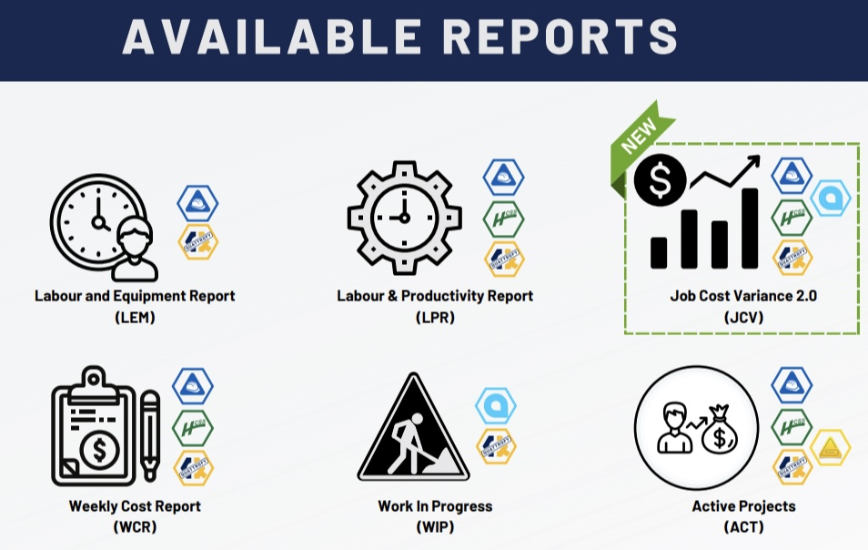
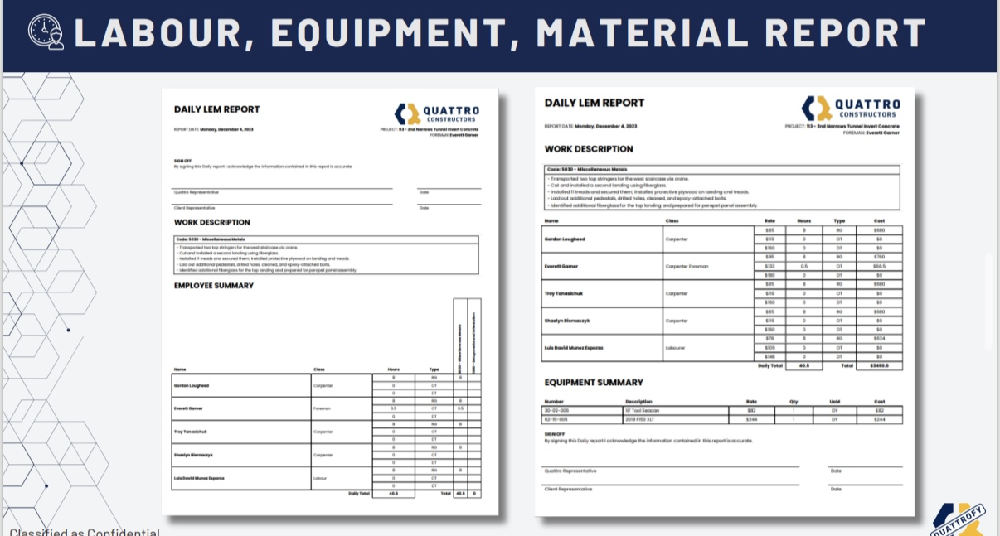
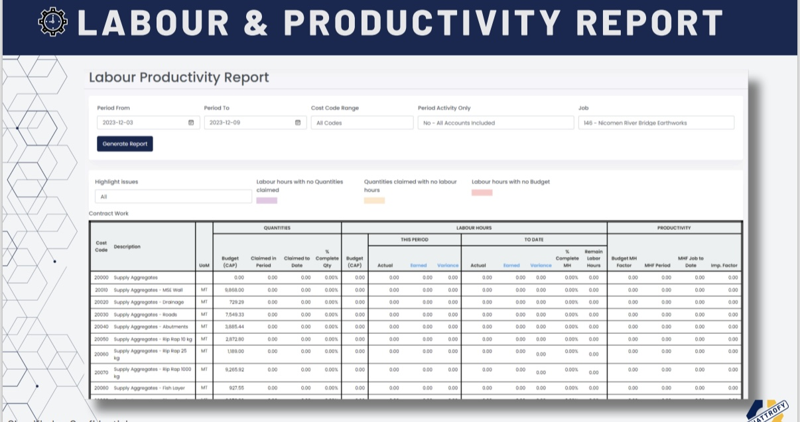
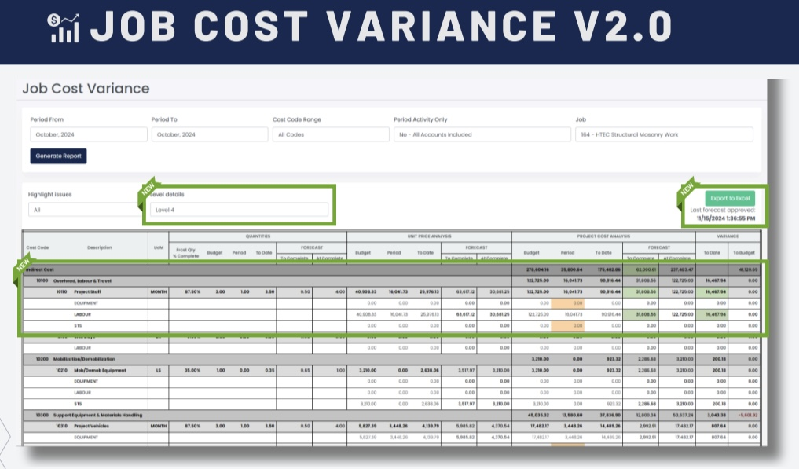

# 📊 Quattrofy

---

## 🧭 Overview
**Quattrofy** is a robust enterprise-grade web application built for **Quattro Constructors**, designed to centralize reporting, operations, and project insights across departments. Developed in **C#** using **ASP.NET MVC**, hosted on **Microsoft Azure**, and integrated with an **Azure SQL Database**, Quattrofy is actively maintained and expanded as part of the company’s digital transformation initiative.

Originally conceived to automate the generation of LEM (Labour, Equipment, and Materials) reports by pulling data from HeavyJob via Open API, it has evolved into a powerful internal platform supporting various modules for employees, equipment, procurement, forecasting, dashboards, and more.

### Vision

### Modules

### Employees

### Forecast

### Projects

### Reports

### LEM

### Labour and Productivity Report

### Job Cost Variance

---

## ✨ Features & Functionality
- **LEM Report**: Dynamic grid of employees and equipment by timecard, job site, cost code, and notes with sign-off flow.
- **Dynamic Login & Roles**: Access and navigation based on user roles from system admin panel.
- **Dashboard Homepage**: Includes weather data, rotating project photos, and embedded Power BI dashboards.
- **Operations Reports**:
  - LEM (Labour, Equipment, Materials)
  - LPR (Labour Productivity Report)
  - JCV (Job Cost Variance)
  - FRC (Forecast)
  - WCR (Weekly Cost Report)
  - WIP (Work In Progress)
  - ACT (Active Projects)
  - CSF (Cashflow)
  - QTY (Quantities)
- **Procurement**:
  - Purchase Orders
  - Payment Applications
- **Employee**:
  - Employee List
  - Pay Classes
  - Internal Rates
  - Force Account Rates
  - Employee Dispatch
- **Equipment**:
  - Equipment List
  - Equipment Dispatch
  - Internal & Force Account Rates
- **System Admin**:
  - User Management
  - Role-based Access & Module Mapping
  - API Sync & Permissions
- **Profile Page**: User photo and profile management.

---

## ⚙️ Tech Stack
| **Category**             | **Tools & Technologies** |
|--------------------------|--------------------------|
| **Backend**              |  |
| **Frontend**             |       |
| **Data Format**          |  |
| **Framework**            |  |
| **Security & Identity**  |   |
| **Database**             |   |
| **Cloud & Hosting**      |    |
| **APIs & Integrations**  |      |
| **API Protocols**        |   |
| **Analytics & BI**       |   |
| **Automation**           |  |
| **DevOps & Version Control** |    |
| **Project Management**   |  |

---

## 🏗 Architecture & Deployment

- **Frontend**: ASP.NET MVC Views with Razor, HTML, CSS, JavaScript, jQuery
- **Backend**: C# Controllers, Microsoft Identity, Service Layer, API integrations
- **Database**: Azure SQL Server
- **Hosting**: Microsoft Azure App Service with Deployment Slots (Staging/Production)
- **Authentication**: Microsoft Identity with role-permission mapping
- **Monitoring**: Azure Application Insights (planned)

---

## 🚀 Deployment & Access

- Hosted in Azure Web Services
- Staging and Production slots
- App auto-start and monitoring enabled

> Access restricted to internal corporate users with valid roles assigned.

---

## 🔒 Security

- All API calls secured via Power Automate and token-based authentication
- Role-based access control per module
- Deployment security hardening on Azure

---

## 📌 Current Status

- **Status**: Actively maintained and developed
- **Version**: v1.x (multi-module)

---

## 📈 Future Enhancements

- Add mobile support
- Expand integrations with SharePoint and OneDrive
- Improved user analytics and audit logs
- Automated notifications for LEM signoffs and Procurement steps
